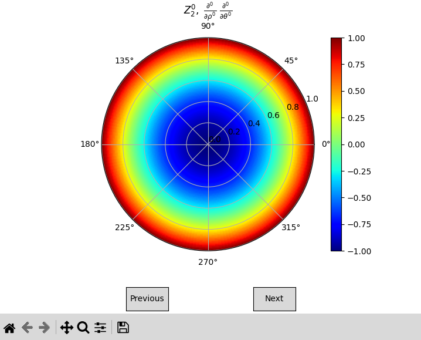

# pyzernike

## Description

`pyzernike` is a Python package to compute Zernike polynomials and their derivatives. 
See the documentation below for more informations.

Example of usage :

```python
import numpy
from pyzernike import zernike_polynomial

rho = numpy.linspace(0, 1, 100)
theta = numpy.linspace(0, 2*numpy.pi, 100)
result = zernike_polynomial(rho, theta, n=[2], m=[0])
polynomial = result[0]  # result is a list, we take the first element
```

Also compute the symbolic `sympy` expression and display the polynomials as follow :



## Authors

- Artezaru <artezaru.github@proton.me>

- **Git Plateform**: https://github.com/Artezaru/pyzernike.git
- **Online Documentation**: https://Artezaru.github.io/pyzernike

## Installation

Install with pip

```
pip install git+https://github.com/Artezaru/pyzernike.git
```

Clone with git

```
git clone https://github.com/Artezaru/pyzernike.git
```

## License

See LICENSE
